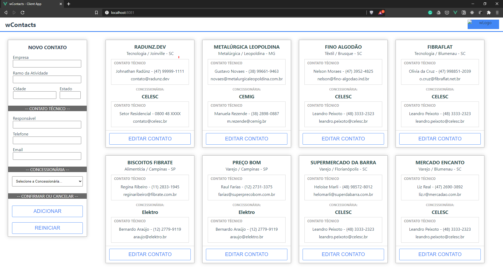

# wContacts

<p align="center">
  
</p>

**wContacts** é um desafio/teste para uma vaga de dev-ops/fullstack que participei. 
A aplicação é uma simples agenda que lista os contatos dos clientes e seus respectivos responsáveis técnicos tanto internamente dentro do cliente quanto na concessionária de energia. Esta aplicação é utilizado por um fornecedor intermediário entre estas duas pontas.


## :rocket: Tech Stack

- Vue.js como framework front-end;
- Vuex como gerenciador de estado;
- Vue Resource para consumo da API REST.
- ASP.NET Core como framework back-end;
- Entity Framework como ORM;
- PostgreSQL para persistência dos dados;
- Azure para deploy da aplicação final;
- ElephantSQL como *Database as a Service*.


## 💻 Sobre o projeto

Este projeto tinha como requisitos disponibilizar os dados dos clientes de forma a auxiliar o time de operações. Após consumir os dados de uma API legada, os dados deviam ser convertidos de forma a otimizar os dados redundantes. Para isso, duas entidades foram pensadas: clientes e concessionárias.

A aplicação permite a exibição e alteração dos cadastros em uma única tela.

Todos os nomes e números foram gerados através do [Gerador de Pessoas](https://www.4devs.com.br/gerador_de_pessoas).


## :wrench: ToDo

- [ ] Tornar a aplicação responsiva;
- [ ] Adicionar validações (back-end);
- [ ] Tornar validação mais intuitiva (front-end).

~
Não será feito, mas é o mínimo que consigo pensar por agora...

<br/>

___

<br/>

## Obtendo o código fonte e executando

Após fazer clonar o repositório, você pode executar o frontend rodando: 


O projeto já está configurado para utilizar SPA. Para fazer deploy, compilar o código vue e utilizar a pasta wwwroot do projeto. 

#### Iniciando o servidor da API REST [.net core 2.1]
```
cd W2contacts
dotnet restore
dotnet run
```

#### Iniciando servidor de desenvolvimento [vue 2.x]
```
cd w2c-client
npm install
npm run serve
```
